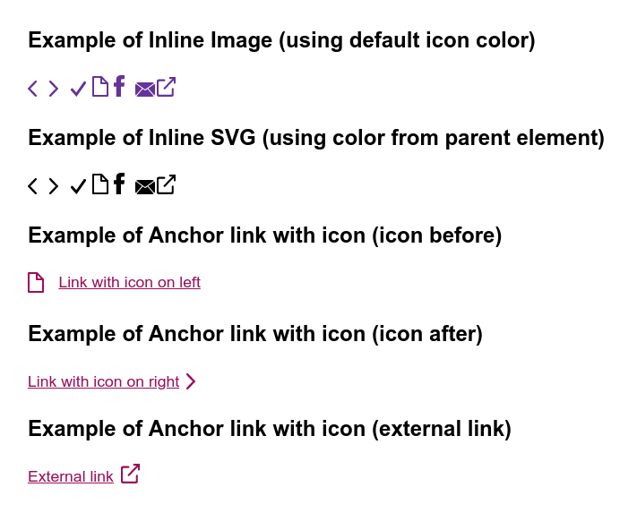

# Next.js inline SVG icon system

This icon system should fit all Next.js projects.

## Preview


## Reusable components

There are [3 general components](./components/General) to demonstrate how flexible this svg icon component can be.
- `<AnchorLink />`
- `<AnchorLinkWithIcon />`
- `<Icon />`

## Run locally
```
npm run dev
```

## Build & start
```
npm run build
npm run start
```

## Guidelines for proper formatting for SVG files

- All svg elements (rect, circle, ellipse, line, polyline, polygon) should be converted to **path**.
- Path element should be using **fill** instead of **stroke**.
- **Optional:** For inline svg it is recommended to remove or change width/height of `<svg>` to 100% - `<svg width="100%" height="100%">`, otherwise scaling/resizing in css will not work as expected.

## Useful stuff

### Cleanup SVG files

Single file:

```
INPUT=./static/svg/original/document.svg OUTPUT=./static/svg/document.svg npm run svgo
```

Bulk:

```
INPUT=./static/svg/original/* OUTPUT=./static/svg/ npm run svgo
```